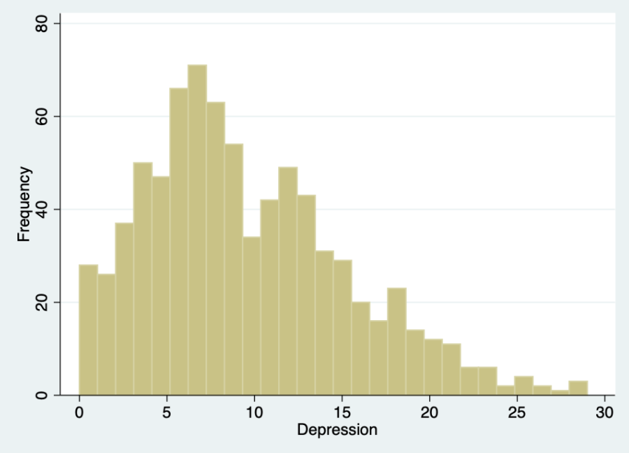
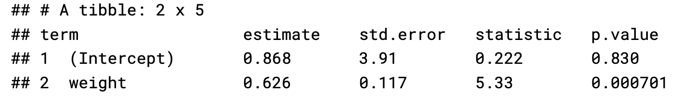
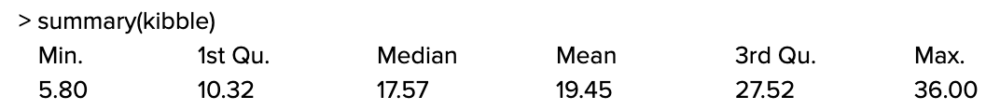

## Instructions
Return via email as a Word document to ph142@berkeley.edu. Do not handwrite your answers or convert to a PDF. Please highlight your answer(s) for any multiple choice questions and type your answer where indicated for short answer or fill in the blank questions.


Lecture Content: 
Monday of same week: Intro to Regression
W/F of previous week: Describing Data w/ numbers + Exploring Relationships between 2 variables 

## Question 1 [4 points total]


**1.1 [1 point] True/False: We use bar charts to graph continuous data and histograms to graph categorical data.**

a) True
b) False

```{r, include = F}
#solution: b) False
```

**1.2 [2 points] The ___________________, which is comprised of the min, Q1, median, Q3, and max, is a concise way of reporting the spread of a distribution.**

**Fill in the blank using lowercase letters only.**

```{r, include = F}
#solution: five number summary
```

**1.3 [1 point] In a box plot, the points past the edge of the upper whisker are considered to be (the): 	 ** 

a) median
b) maximum
c) mean
d) outliers
e) too extreme

```{r, include = F}
#solution: d) outliers

```

## Question 2 [2 points total]

**In 2014, the UC Berkeley Graduate Assembly released the Graduate Student Happiness & Well-Being Report. The report included this graph showing the results from the Center for Epidemiologic Studies - Depression Scale (CES-D) for the respondents. ** <p>

```{r, echo = F, out.width = "75%"}

```
**Select all of the following that accurately describe the distribution above.**

a) unimodal
b) bimodal
c) multimodal
d) mean is greater than median
e) mean is less than median
f) right skewed
g) left skewed

```{r, include = F}
#SOLUTION: a) unimodal d) mean is greater than median f) right skewed
```

## Question 3 [3 points total]
**You’re examining the relationship between dog weight (in pounds) and amount of kibble consumed on a monthly basis (pounds per month). You’ve cleaned your data and run lm() on your data and R returns the following result:**

```{r, echo = F, out.width = "75%"}


```


**3.1 [2 points] Using the output from lm() above, write out the equation for the line of best fit in the form y = ax+b. Do not round any numbers.**

a) a = _______
b) b = _______

```{r, include = F}
#SOLUTION a = 0.626, b = 0.868
```

**3.2 [1 point] Does the y-intercept of this output have real-world meaningfulness?** 

a) Yes
b) No 

```{r, include = F}
#SOLUTION: b) No 
```

## Question 4 [1 point total]

**Calculate the IQR of using the data below.**
```{r, echo = F, out.width = "75%"}

```
IQR = ______
```{r, include = F}
#SOLUTION: IQR = 27.32 - 10.32 = 17
```


